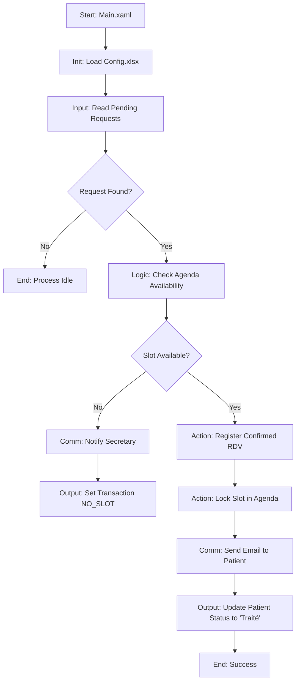

# 🩺 RPA Workflow Documentation

This document provides a detailed technical reference for the **Automated Medical Appointment Scheduling** RPA process.

## 🏗️ System Architecture

The system follows a three-tier architecture:
1.  **Frontend (React)**: Patient interface for booking requests.
2.  **Backend (Node.js)**: API layer managing Excel data and exposing state to the frontend.
3.  **RPA Robot (UiPath)**: The "brain" that processes pending requests, manages calendar conflicts, and sends notifications.

---

## 🔄 High-Level Process Flow

---

## 🧩 Workflow Registry

| Workflow | Path | Responsibility |
| :--- | :--- | :--- |
| **Main** | `Main\Main.xaml` | Master orchestrator and exception handler. |
| **Init Settings** | `Workflows\InitAllSettings.xaml` | Loads parameters from `Data\Config.xlsx` into a Dictionary. |
| **Read Requests** | `Workflows\LireDemandesExcel.xaml` | Fetches the first "En attente" patient from Excel. |
| **Check Availability** | `Workflows\VerifierDisponibiliteAgenda.xaml` | Scans the doctor's calendar and identifies conflicts. |
| **Register RDV** | `Workflows\EnregistrerRDVExcel.xaml` | Writes confirmed appointment details to the central repository. |
| **Update Agenda** | `Workflows\MettreAJourAgenda.xaml` | Marks a time slot as "Occupé" in the physician's calendar. |
| **Notify Patient** | `Workflows\EnvoyerNotificationPatient.xaml` | Sends dynamic HTML emails (Confirmation vs. Rescheduling). |
| **Close Request** | `Workflows\MettreAJourStatutDemande.xaml` | Updates the status of the processed patient to "Traité". |
| **Notify Secretary** | `Workflows\NotifierSecretaire.xaml` | Alerts staff when no slots are available for a patient. |

---

## 🛠️ Detailed Technical Specifications

### 1. `VerifierDisponibiliteAgenda.xaml`
*Core logic for conflict resolution.*

**Arguments:**
| Name | Direction | Type | Description |
| :--- | :--- | :--- | :--- |
| `in_Config` | In | Dictionary | Global configuration settings. |
| `in_HeureSouhaitee` | In | String | The time requested by the patient. |
| `in_DateSouhaitee` | In | String | The date requested by the patient. |
| `out_DateRDV` | Out | String | The actual confirmed date. |
| `out_HeureRDV` | Out | String | The actual confirmed time. |
| `out_DisponibiliteTrouvee`| Out | Boolean | Flag indicating if any slot was found. |
| `out_IsRescheduled` | Out | Boolean | **True** if the assigned slot differs from the requested one. |

**Logic:**
1.  Reads `Agenda_Medecin.xlsx`.
2.  Attempts to find the exact `Date` and `Heure` requested with `Statut = "Libre"`.
3.  If found, confirms that slot.
4.  If **NOT** found, searches for the next closest available "Libre" slot.
5.  Sets `out_IsRescheduled` to `True` if a fallback slot is used.

---

### 2. `EnvoyerNotificationPatient.xaml`
*Dynamic communication engine.*

**Arguments:**
| Name | Direction | Type | Description |
| :--- | :--- | :--- | :--- |
| `in_Config` | In | Dictionary | Contains SMTP credentials and server info. |
| `in_PatientEmail` | In | String | Recipient address. |
| `in_IsRescheduled` | In | Boolean | Determines which email template to use. |
| `in_HeureOriginale` | In | String | Time originally requested (used in reschedule emails). |
| `in_HeureAttribuee` | In | String | New confirmed time. |

**Logic:**
- Uses **SMTP (Gmail)** with TLS encryption.
- **Template A (Blue)**: Sent when the requested slot is confirmed.
- **Template B (Orange)**: Sent when the slot is rescheduled, including an explanation for the change.

---

### 3. `MettreAJourAgenda.xaml`
*Resource management.*

**Arguments:**
| Name | Direction | Type | Description |
| :--- | :--- | :--- | :--- |
| `in_Config` | In | Dictionary | Configuration. |
| `in_DateRDV` | In | String | Target date. |
| `in_HeureRDV` | In | String | Target time. |
| `in_PatientNom` | In | String | Name of the patient to associate with the slot. |

**Logic:**
- Iterates through the Agenda DataTable.
- Matches row based on `Date` and `Heure`.
- Updates `Statut` to `"Occupé"` and `Patient` to `in_PatientNom`.
- Saves the workbook to persist the lock.

---

## 📊 Data Schemas (Excel)

### `Demandes_Patients.xlsx`
| Column | Type | Role |
| :--- | :--- | :--- |
| `ID` | String | Primary Key |
| `Statut` | String | Workflow State (`En attente` / `Traité`) |
| `HeureRDV` | String | User Input |

### `Agenda_Medecin.xlsx`
| Column | Type | Role |
| :--- | :--- | :--- |
| `Date` | Date | Slot Identifier |
| `Heure` | String | Slot Identifier |
| `Statut` | String | Resource State (`Libre` / `Occupé`) |

---

## ⚠️ Exception Handling

- **No Slots Available**: If the robot cannot find any free slot in the agenda, it invokes `NotifierSecretaire.xaml` and sets the `TransactionStatus` to `NO_SLOT`. The patient's status remains "En attente" for manual intervention.
- **Missing Configuration**: `InitAllSettings.xaml` includes validation to ensure critical keys like `ExcelAgendaPath` and `SmtpPassword` are present.
